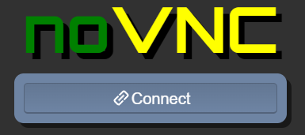
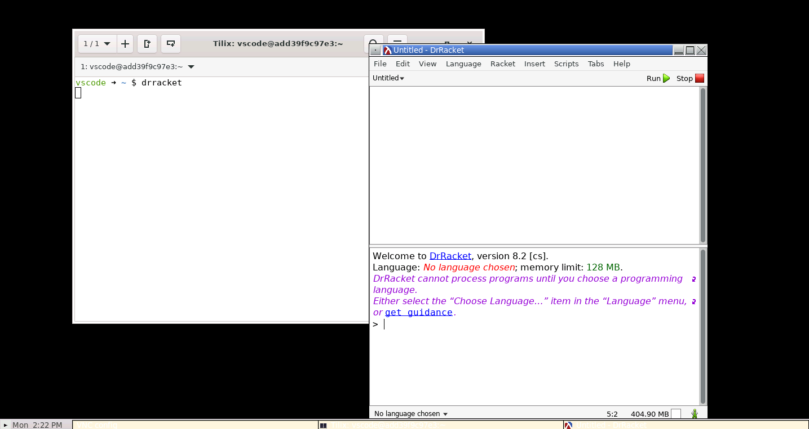
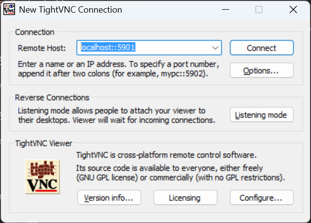

# Sample Racket

This is an example Racket project used in Daytona.

---

## 🚀 Getting Started  

### Open Using Daytona  

1. **Install Daytona**: Follow the [Daytona installation guide](https://www.daytona.io/docs/installation/installation/).  
2. **Create the Workspace**:  
   ```bash  
   daytona create https://github.com/daytonaio/sample-racket
   ```  
3. **Start the Application**:  
   ```bash  
   racket main.rkt
   ```  
4. **Using desktop IDE through VNC protocol and noVNC client**

noVNC is a JavaScript library that implements a VNC (Virtual Network Computing) client in HTML5, allowing users to access remote desktops directly through web browsers without plugins. It uses HTML5 Canvas and WebSockets to provide remote desktop functionality.

Type CTRL + shift + P and `Ports: Focus on Ports View`.

Click on `Forward a Port` button.

Add `6080` in Port column, browse to http://localhost:6080 and connect through noVNC.



You can open a terminal, run DrRacket



Open `/workspaces/sample-racket/main.rkt`

5. **Using desktop IDE through VNC protocol and other VNC clients**

Download install and run a VN client such as TightVNC.

Add `5901` in Port column.

Connect to `localhost::5901`



You can open a terminal, run DrRacket...

---

## ✨ Features  

standardized development environment with devcontainers

console application

desktop environment available through VNC
